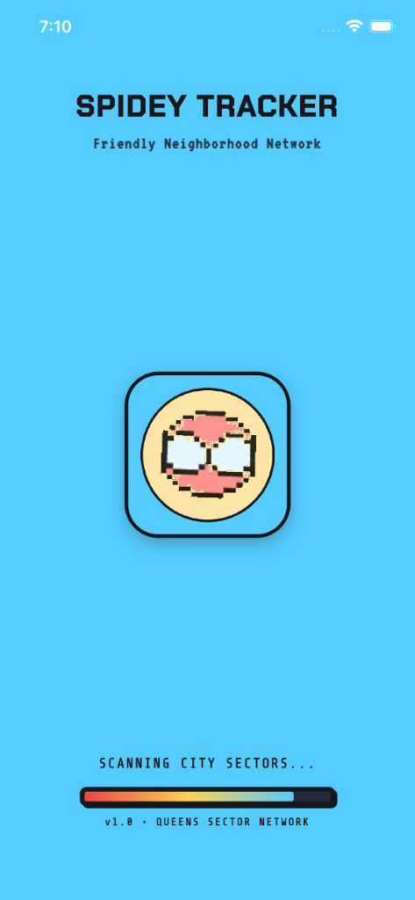
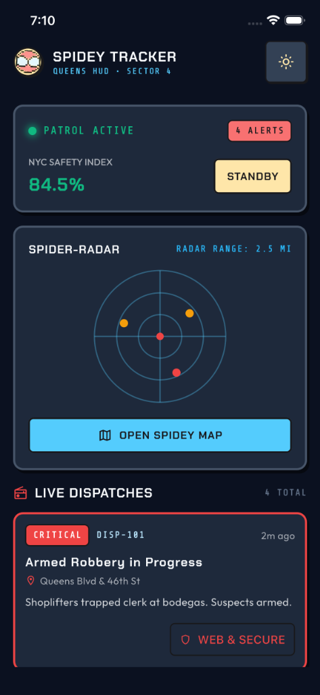
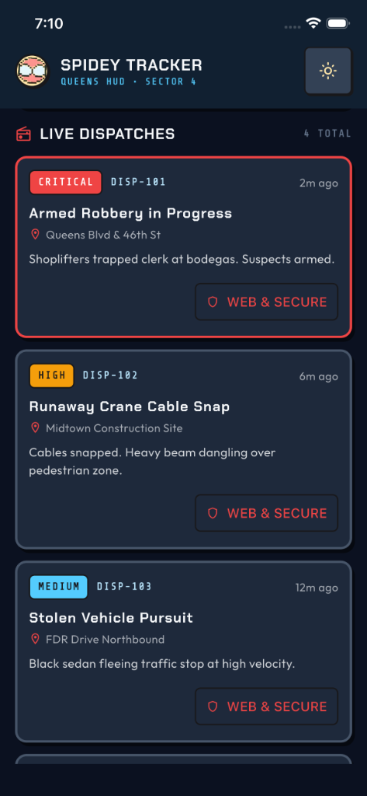
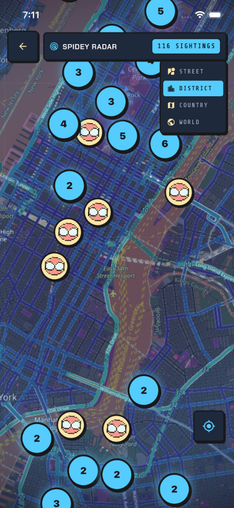
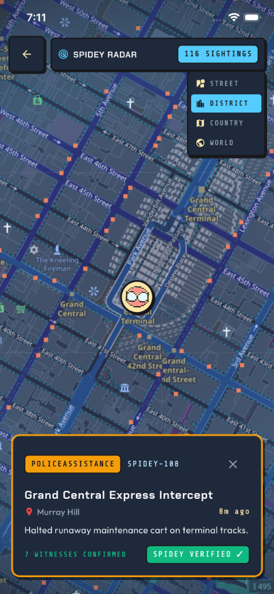

<p align="center">
  
</p>

<h1 align="center">🕷️ Spidey Tracker</h1>

<p align="center">
  <b>A Spider-Man: Brand New Day & Insomniac FNSM-inspired Dispatch & Crime Radar Flutter App.</b>
</p>

<p align="center">
  
  
  
  
  
</p>

---

## 🌟 Overview

**Spidey Tracker** is a Flutter application designed with the retro-comic aesthetic of *Spider-Man: Brand New Day* combined with the interactive crime radar and dispatch telemetry of the **Friendly Neighborhood Spider-Man (FNSM)** in-game app from Insomniac's *Spider-Man* series.

The app tracks real-time Spider-Man sightings, active city crimes, villain encounters, and neighborhood distress calls across New York City and global hubs with live marker clustering, dark tactical radar styling, and GPS integration.

---

## 📱 Screenshots

<p align="center">
  
  
  
  
  
</p>

| Splash Screen | Home Dispatch Tracker | Live Crime Alerts | Clustered Radar Map | Sighting Details |
|:---:|:---:|:---:|:---:|:---:|
| Comic Retro Intro | Patrol Status & Radar | Critical Dispatches | 100+ Clustered Pins | Verified Encounter Card |

---

## 🚀 Features

- 🗺️ **Interactive OpenStreetMap Spider-Radar**: Full-screen radar map powered by `flutter_map` with dynamic Dark/Light retro matrix styling.
- 📍 **Custom Spidey Markers & Clustering**:
  - Pixel Spidey mask pins with cream backing and comic borders.
  - Dynamic marker clustering that groups hundreds of sightings into glowing count badges when zoomed out.
- 🎬 **Automatic Cinematic Dive**:
  - Smooth multi-stage camera sweep zooming from world orbit down into NYC street level (`World` $\rightarrow$ `Country` $\rightarrow$ `District` $\rightarrow$ `Street`).
- 📡 **Live User Location**: Instant GPS acquisition to lock and fly the radar to your coordinates.
- 🚨 **Crime & Dispatch Telemetry**:
  - Real-time district alerts (robberies, villain flare-ups, cat rescues).
  - One-tap dispatch & alert resolution.
- 🎨 **Comic Retro Design System**:
  - Sky Blue (`#54CCFD`), Spidey Red (`#EF4444`), Badge Cream (`#FEE6A9`), and Dark Ink (`#0B1120`).
  - Pixel border cards, custom badges, and comic typography.
- 🌓 **Dynamic Theme Switching**: Light & Dark mode support persisted locally via `shared_preferences`.
- ⚡ **Preloaded State**: Seamless screen transitions with zero latency using background Cubit preloading during splash.

---

## 🏗️ Architecture & Code Quality

The project strictly follows **Clean Architecture**, **SOLID Principles**, and the **BLoC / Cubit** state management pattern:

```
lib/
├── app/
│   ├── app.dart                   # Root MultiBlocProvider & MaterialApp
│   └── app_bloc_observer.dart    # Telemetry logger for Cubit transitions
├── bootstrap.dart                 # Pre-launch bindings & SharedPreferences setup
├── core/
│   ├── constants/                 # Colors, Dimensions, Assets, Strings
│   ├── routes/                    # Type-safe AppRouter & page transitions
│   ├── services/                  # Theme storage service (shared_preferences)
│   ├── theme/                     # Light/Dark ThemeData, Cubit & OSM styles
│   └── widgets/                   # Reusable PixelBorderCard, SpideyBadge, Button
└── features/
    ├── splash/                    # Animated splash sequence & asset preloading
    ├── tracker/                   # Home patrol status, radar widget & crime dispatch
    └── radar_map/                 # OpenStreetMap interactive radar & cluster manager
        ├── domain/                # Entities & Repository contracts
        ├── data/                  # Models & Data sources (100+ NYC/global sightings)
        └── presentation/          # RadarMapCubit, RadarMapView, Header & Sheets
```

---

## 🛠️ Tech Stack & Dependencies

- **Framework**: [Flutter](https://flutter.dev) (Dart SDK 3.x)
- **State Management**: [flutter_bloc](https://pub.dev/packages/flutter_bloc) & [equatable](https://pub.dev/packages/equatable)
- **Mapping & GIS**: [flutter_map](https://pub.dev/packages/flutter_map), [latlong2](https://pub.dev/packages/latlong2), [flutter_map_marker_cluster](https://pub.dev/packages/flutter_map_marker_cluster)
- **Location Services**: [geolocator](https://pub.dev/packages/geolocator)
- **Storage**: [shared_preferences](https://pub.dev/packages/shared_preferences)
- **Typography**: [google_fonts](https://pub.dev/packages/google_fonts)
- **App Icons**: [flutter_launcher_icons](https://pub.dev/packages/flutter_launcher_icons)

---

## ⚡ Getting Started

### Prerequisites
- Flutter SDK installed (`>=3.6.0`)
- Android Studio / Xcode for simulator or physical device testing

### Installation

1. **Clone the repository**:
   ```bash
   git clone https://github.com/ZyadWKhedr/Spidey-Tracker.git
   cd Spidey-Tracker
   ```

2. **Install dependencies**:
   ```bash
   flutter pub get
   ```

3. **Run unit tests**:
   ```bash
   flutter test
   ```

4. **Run the app**:
   ```bash
   flutter run
   ```

---

## 🧪 Testing

Run code analysis and all test suites:

```bash
flutter analyze
flutter test
```

---

## 📄 License

This project is licensed under the MIT License.
